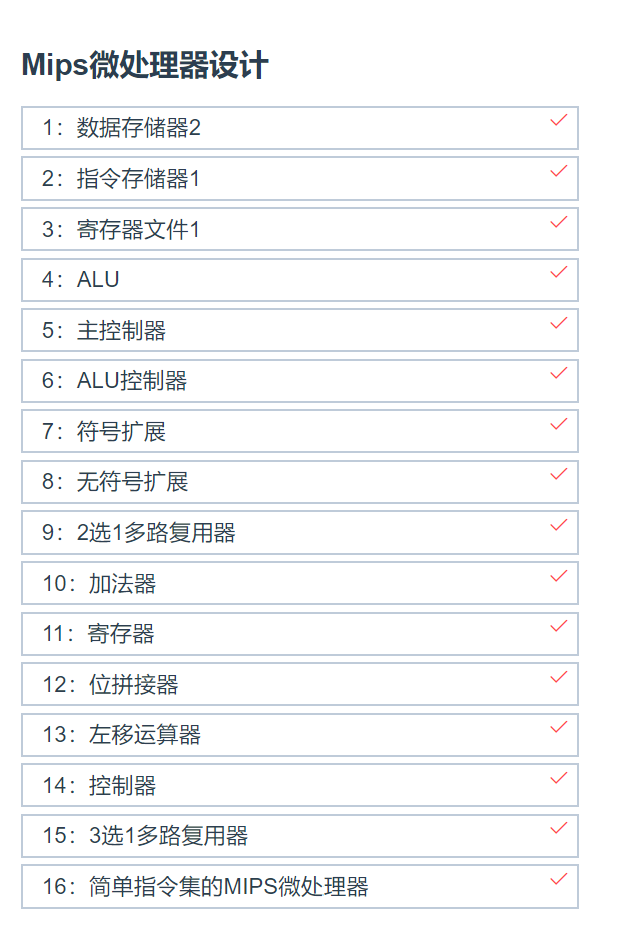
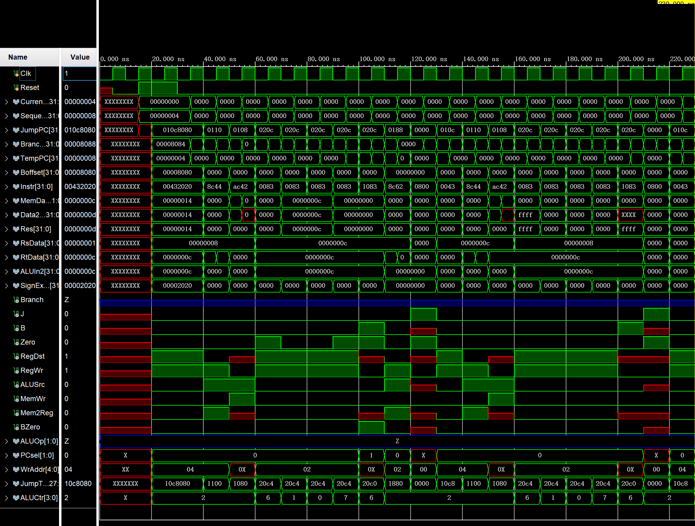

# HUST-MIPS-lesson

## **求求了谁写完了小组的独立任务，也来建设一下仓库，push到新的branch呗**

华中科技大学电信系微机原理实验代码

这里是左冬红老师的课程

**遇到bug及时反馈本人，本人及时修改**

## 更新说明

**version1.1**（2021-4-27）

- 增加了小组作业第三部分的代码，在`GroupWork3`文件夹中，注释和运行图还未添加，后续再更新。另添加了小组作业第三部分的ppt，为当时的思路，不过有略微改动，希望需要的同学们看得懂。另外额外的要求有`bne、bltz、bgez`，本人只验证了`bne`，其他的还没来得及验证，希望是对的吧。。。

---

# 相关说明

- ~~注意！！！！上传到github的工程文件中是有代码的目标路径的，这个直接上传没有办法修改，因此建议大家下载源码手动建立工程~~  **上述问题已经修复，可以直接下载工程**
- 现在只有**版本1**的提交。作业版本：2021-4
- 完成情况 :
  - [x] 任务要求中的非黄色部分，即必做部分
  - [x] 通过网站测试
  - [ ] 小组作业1
  - [ ] 小组作业2
  - [x] 小组作业3
  - [ ] 小组作业4
  - [ ] 选做部分
- 请勿大幅度外传，知道的人自己留着就完事了。
- 写不写选做看情况，毕竟距离交作业就剩4天了（提交代码时2021-4-25）。
- 之后会不会补传其他作业代码或者上传未来作业代码待定。
- **文件仅供参考~~！！！！抄袭概不负责**
- 代码90%以上自己写的，又参照mooc优化了一部分（不过优化后能不能过网站测试还没试，理论上可以的，毕竟接口和变量名没咋变，有问题就根据报错再自己改一下）
- 在`OnlySourceCode`文件夹中，专门总结了用于提交的16个文件，其中`UnsignedExtend`在主工程没有，因为最后没有调用，其实也很简单，就没放到工程里。

---

# 代码可能遇到的问题

- **注意当前(2021-4-26)，**网站的Mainctr代码其实是有错的，问题在于case中的`6'b000010`的译码，根据作业题中的pdf，应该译码为：`9'b1xx0_x0x_xx`，但是为了通过网站测试需要改成`9'b10x0_x0x_xx`。即它对B的译码是错误。然而在其他调用MainCtr的代码中，又必须使用`9'b1xx0_x0x_xx`
- **当前(2021-4-26)**, 实验pdf中给出的ALU计算结果图和视频中所述不一致，实际应该定义成：只要计算结果为0，那么Zero就要为1，当前push的代码是这样的大家不要担心
- **在`mipscpu_sim`中，记得把machinecode的路径改一下**

---

如下为本人提交结果图：

如下为最终仿真图：

