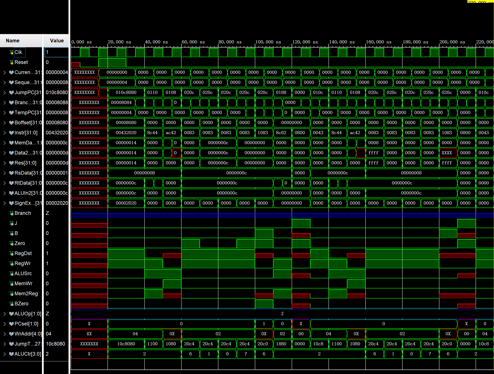

# HUST-MIPS-lesson
华中科技大学电信系微机原理实验代码--version1.0

这里是左冬红老师的课程

---

- 现在只有**版本1**的提交。作业版本：2021-4
- 完成情况 :
  - [x] 任务要求中的非黄色部分，即必做部分
  - [x] 通过网站测试
  - [ ] 选做部分
- 请勿大幅度外传，知道的人自己留着就完事了。
- 写不写选做看情况，毕竟距离交作业就剩4天了（提交代码时2021-4-25）。
- 之后会不会补传其他作业代码或者上传未来作业代码待定。
- **文件仅供参考~~！！！！抄袭概不负责**
- 代码90%以上自己写的，又参照mooc优化了一部分（不过优化后能不能过网站测试还没试，理论上可以的，毕竟接口和变量名没咋变，有问题就根据报错再自己改一下）

---

如下为最终仿真图：

